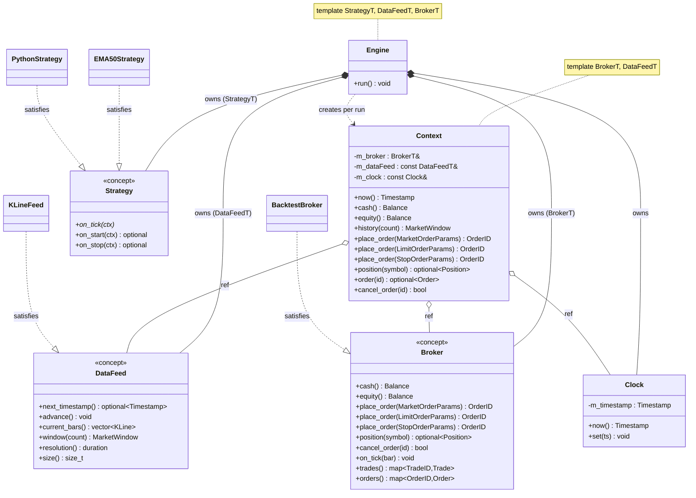
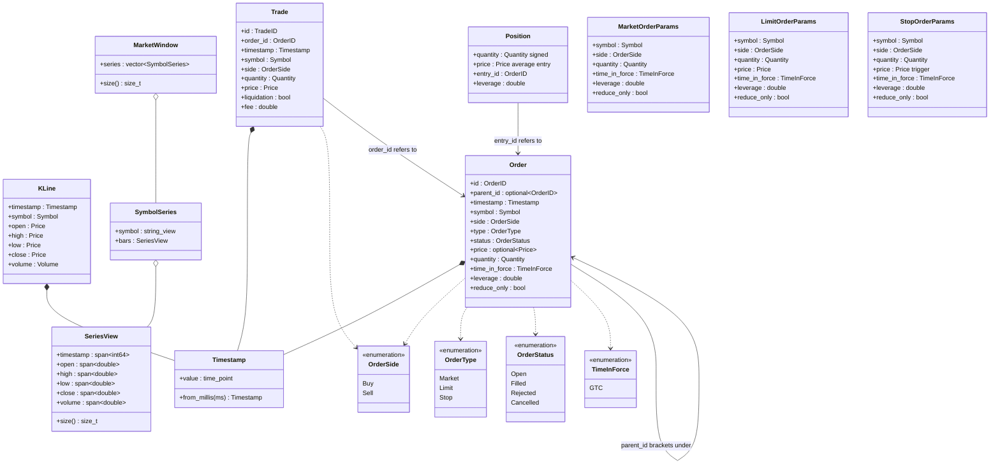
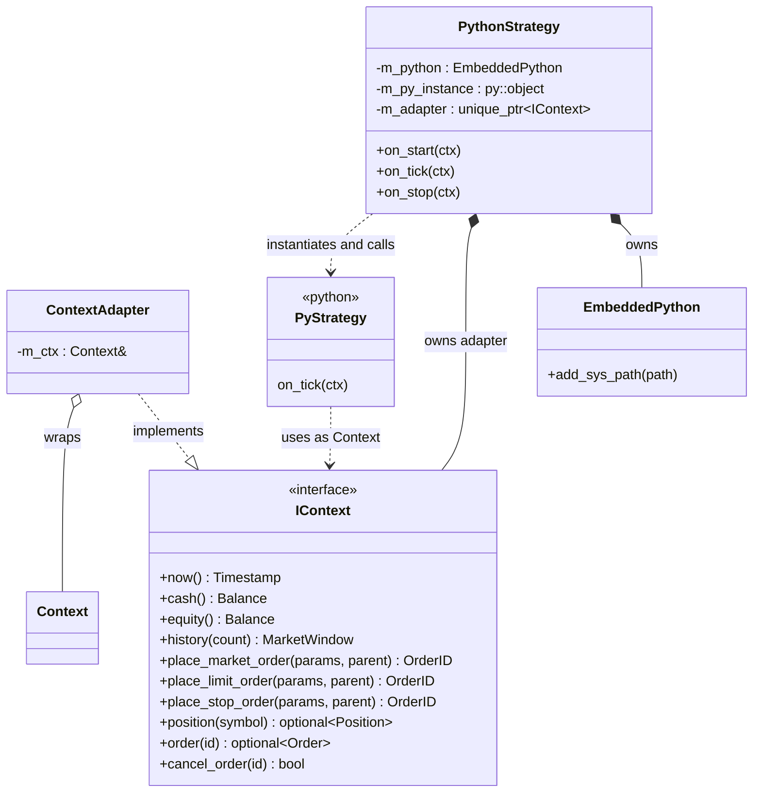
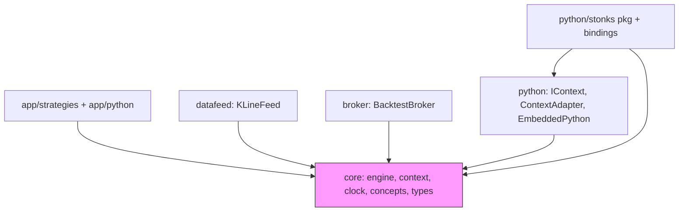
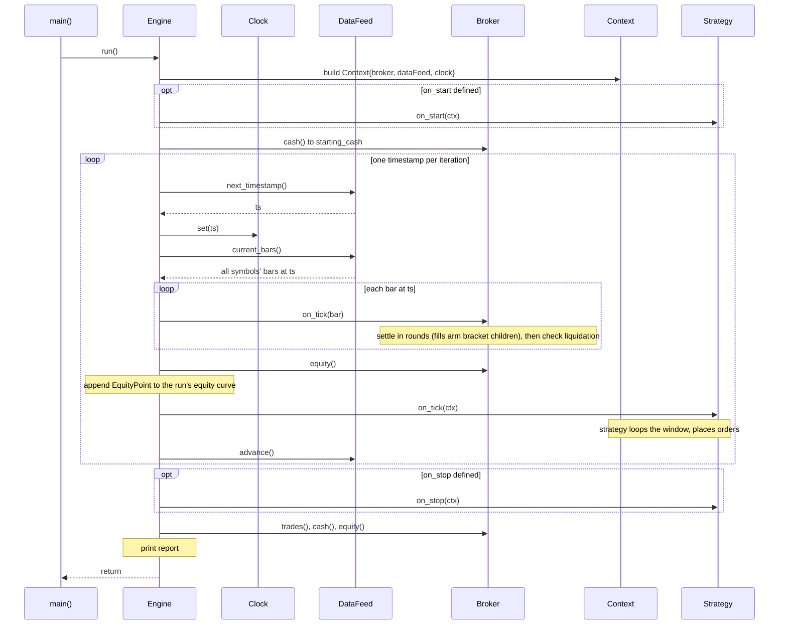
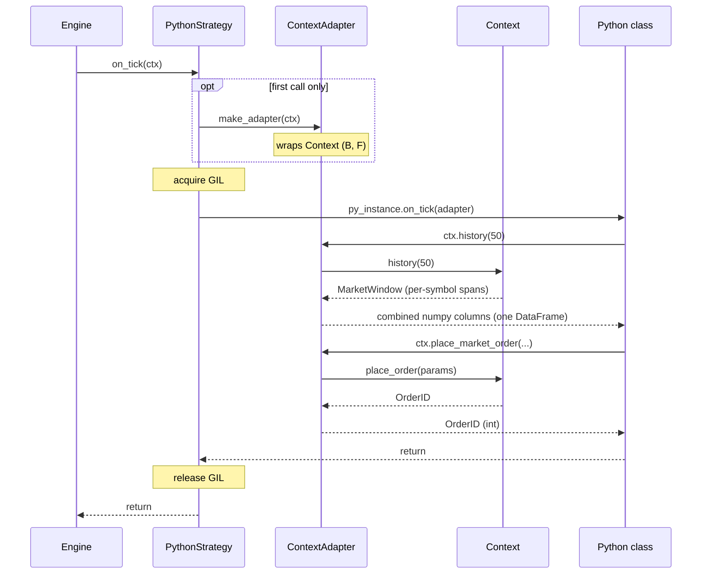

# Architecture diagrams

Mermaid renderings of the engine's structure and runtime flow. The class
diagrams cover the static design; the sequence diagrams cover what happens during
a run.

> Note: `Strategy`, `DataFeed`, and `Broker` are **compile-time C++20 concepts**,
> not virtual interfaces — they're drawn as interfaces here for clarity. The
> engine is a template instantiated for one concrete strategy/feed/broker combo,
> so there are no virtual calls on the hot path.

## 1. Core wiring (engine, context, concepts, implementations)



## 2. Core data types



## 3. Python boundary

The templated C++ `Context` can't bind to pybind11 directly, so a type-erased
`IContext` (bound to Python as `Context`) is implemented by `ContextAdapter`.



## 4. Module dependencies

Everything depends inward on `core`; `core` depends on nothing else. New
strategies, feeds, and brokers plug into the concept slots.



## 5. Sequence — a full backtest run

One strategy tick **per timestamp**: the engine first feeds every symbol's bar
at that timestamp to the broker (settle the past — fill prior orders, mark
prices), then calls the strategy **once** (decide the future). That ordering is
what stops an order from filling on the same timestamp it was placed.



## 6. Sequence — order lifecycle (the no-lookahead gate)

One order followed across the two bars it touches. The single check
`order.timestamp >= bar.timestamp` (reject) is the whole guarantee: an order
placed at bar N cannot fill until a bar strictly after N.

Bracket children are the one refinement: a child keeps its original placement
timestamp (always earlier than any bar its parent can fill on), so once the
parent fills, the same gate admits it from the parent's **fill bar** onward —
the broker settles each bar in rounds until no order makes progress, ordering
each round's candidates Market → Stop → Limit under the default Conservative
policy (protective stops before profit targets).

```mermaid
sequenceDiagram
    participant E as Engine
    participant Ctx as Context
    participant S as Strategy
    participant B as Broker

    rect rgb(235, 245, 255)
        Note over E,B: Bar N (clock = N)
        E->>B: on_tick(bar_N)
        Note over B: mark last_price; no order for it yet
        E->>S: on_tick(ctx)
        S->>Ctx: history(n)
        Note over Ctx: symbols printing at N, each bounded to <= N
        Ctx-->>S: MarketWindow (cannot see N+1)
        S->>Ctx: place_order(MarketOrderParams{...})
        Ctx->>B: place_order(params)
        Note over B: Order built + stamped (timestamp = now() = N), queued
    end

    rect rgb(235, 255, 235)
        Note over E,B: Bar N+1 (clock = N+1)
        E->>B: on_tick(bar_N+1)
        Note over B: try_fill: order.ts(N) >= bar.ts(N+1)? NO, gate passes
        Note over B: fill at bar_N+1.open; update cash/position; record Trade; dequeue
    end
```

## 7. Sequence — Python strategy detour

When the strategy is `PythonStrategy`, the engine's `on_tick(ctx)` expands into
this. The adapter is built once (lazily) and reused; the GIL is acquired per
call. From the engine's side it's indistinguishable from a C++ strategy.


